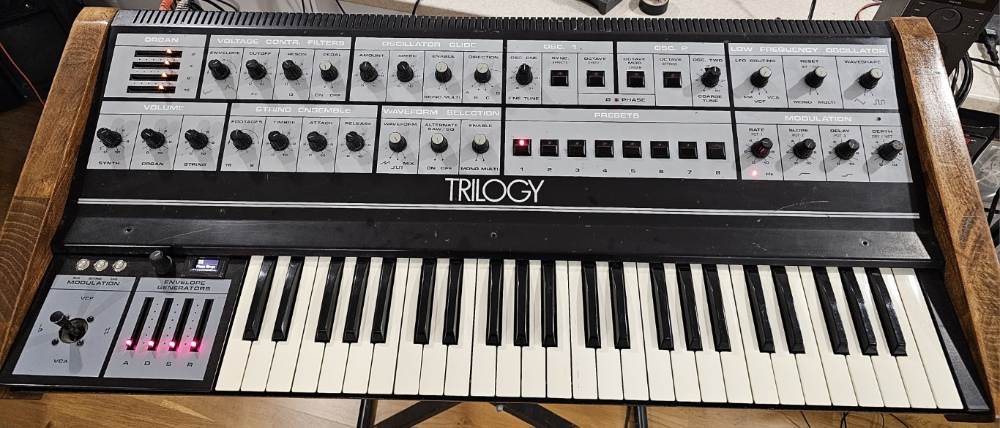

Converting the Crumar Trilogy to fully programmable + effects

Many moons ago when I bought a Crumar Trilogy new from Chase Music in Manchester I soon realized that it was not the best "synthesizer" for the money and really it was just a glorified organ/strings machine.

It only had 7 memories and the front panel for the synth and these memories only remembered about 9 settings of the synth on preset boards pot boards under the front panel. So no easy save and recall procedures and certainly limited parameters, Attack, Decay, Sustain, Release, Cutoff, Resonance, ADSR position, waveform and alt waveform I think, So not even the LFO, glide, VCO settings could be stored as that would affect the organ and strings.

I did add another 7 memories to my own Trilogy with an additional programmer board and some logic, but again not ideal.

The Trilogy was sold when the DX7 came out and I really didn't mind too much, no cheezy strings anymore, but lots of new sounds.

Many years later I acquired a Trilogy locally for a few hundred pounds and decided to try and make it what it should have been from day 1. A polysynth with memories.

I had little to no experience of programming Arduino/Teensy, but I understood how polysynths worked and set about designing a mux and demux with memories to read the front panel and store values and write them out again. I built a board to replace the presets board with the same footprint and started to read in all the synth controls that the old preset board managed. I used voltage dividers to drop the voltages down to 3.3v for the Teensy so I could still use the 0-15v controls that the Trilogy had. I then used opamps to boost the voltage on the demux to voltages required for the synth section. Once this was working I had replicated what the Trilogy could originally remeber but now in 999 locations.

I then went on to work on the VCO section and read in the octave, octave mod and sync buttons and again store and write them out to the synth. This worked well and added a new dimesnion to the programming capabilities of the Trilogy. 

Next was the LFO and that was probably my biggest challenge as the Trilogy LFO had slope and delays, a multi trigger and was not fully voltage controlled. I got around this by replacing the LFO with an electric druid Taplfo3 chip which is fully voltage controlled and then I used a Teensy 2.0 coprocessor to read in the triggers and gates to control the triggering and retriggering of an Envgen8c to generate slope, the T2.0 also read the delay CV generated by the main T3.6 to control the delay time for the LFO. This was probably the hardest part of the project for me as I had to work ou tthe logic etc and as I said it was early on in my programming career (hobby).

The glide section was again replaced with an Envgen8C which made the voltage control easier than the CEM3310 used originally. This gave full program control of the glide section along with the LFO.

The organ setcion was easier, a simple quad VCA replaced the sliders, the sliders were used to generate the 0-3.3v for the Teensy MUX and the demux generated 0-2v to control the AS3364 quad VCA for voltage control over the 2, 4, 8 and 16 foot volumes.

Finally the strings, I had to create a filter for the timbre using a VCA and also the footage mixes 8 & 16 foot strings, also the control voltages for the CEM3310 used for the attack and release of the strings. It was quite noisy at first as I was using V2164 VCA chips, I later swapped them for AS3364 and the sound improved dramatically. I also added another 3 VCA's to control the Strings, Synth and Organ master volumes, this allowed me to make 3 way mixes of Synth, Strings and Organ and store them in the memory.

All parameters are stored with the exception of the VCO 2 tuning, at the time my demux deisgn was rather flaky and the tuning was unstable. So I decided not to control the Master Tune. However I have now learnt how to make the demux stable and the tuning could be under control of the processorm but currently isn't.

You may have noticed there are no schematics, unfortunately I didn't document much of this except for notes in a book that I have, it is fairly straightforwards as far as the MUX and demux are concerned but I would have to measure the output voltages to know what they were and I cannot for the life of me remember the schematics for the delayed LFO. Just the principles behind it. I might spend some time in the future and draw the schematics from my notes, but for now, know that it can be done and works well. 

It now has a MIDI in socket so I can send it program changes etc.

I also recently added an FV-1 effects processor board so now you can add various effects such as reverb, echo, flanger, phaser etc to any section or all sections of the Trilogy.
